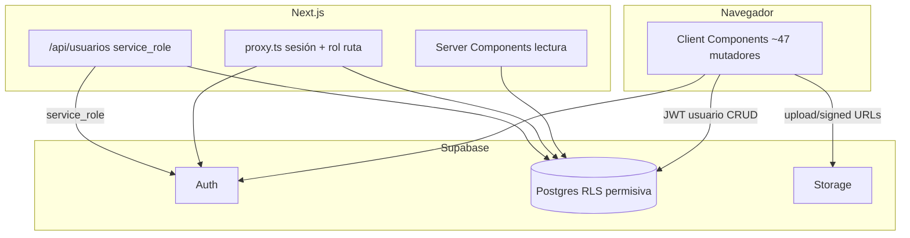
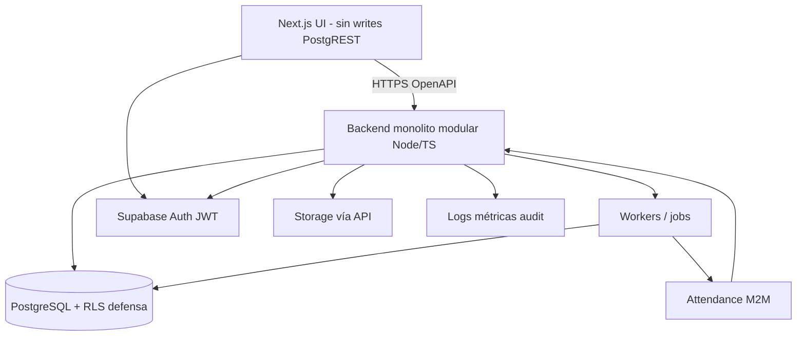

# Dinamic Clean — Auditoría técnica empresarial integral

**Fecha:** 2026-09-15  
**Clasificación final:** `NOT_READY_FOR_ENTERPRISE_PRODUCTION`  
**Estándar aplicado:** plataforma empresarial crítica (>200 empleados), con **backend tradicional obligatorio**.

**Artefactos:**  
`dinamic-clean-enterprise-findings.csv` · `dinamic-clean-enterprise-remediation-roadmap.md` · `dinamic-clean-enterprise-evidence.md` · `dinamic-clean-backend-migration-inventory.csv` · `dinamic-clean-production-gates.md`

---

## 1. Resumen ejecutivo

Dinamic Clean es una aplicación **Next.js 16 + React 19 + Supabase** que centraliza (o pretende centralizar) RRHH, compras, CRM, auditoría de calidad y resultados económicos. El producto **compila**, tipa y ofrece UX por roles; **no** cumple los requisitos de una plataforma empresarial crítica.

Hallazgos estructurales:

1. **No existe backend tradicional independiente** (E-001). Casi todas las mutaciones sensibles ocurren desde el navegador vía PostgREST (`createBrowserClient` en ~47 archivos). El único handler privilegiado es `/api/usuarios`.
2. **La autorización efectiva falla**: RBAC en `proxy.ts`/`permisos.ts` es navegación; RLS versionada usa `USING (true)` (E-002, E-003). El navegador **puede evadir** menús y roles.
3. **Integridad de procesos críticos rota** ante fallos parciales y estados manipulables (E-008, E-009).
4. **No hay continuidad, observabilidad ni calidad gates** demostrables (E-013, E-014, E-020; G4–G6).
5. **El esquema productivo no es reproducible desde Git** (E-004; G0).
6. **Integración Attendance no es iniciable de forma segura** sin backend + contratos + cierre de grants (E-015, G9).

Por política del proyecto, sin backend tradicional **no** puede clasificarse como `ENTERPRISE_PRODUCTION_READY` ni `READY_FOR_CONTROLLED_PILOT`.

---

## 2. Contexto y criticidad

Empresa real >200 empleados. Datos y procesos impactan nómina implícita (asistencias/ausencias), compras, finanzas, clientes, PII laboral y continuidad operativa. Un bypass de rol, import parcial o pérdida de DB tiene **impacto de negocio directo**, no cosmético.

Esta auditoría **no** trata el sistema como MVP interno de bajo riesgo.

---

## 3. Alcance

- Repositorio Git completo (frontend, migraciones parciales, config).
- Análisis adversarial de authz, integridad, ops, integración.
- Comandos locales: install, tsc, lint, build (sesión previa), npm audit.
- **Fuera de alcance ejecutado:** Supabase remoto, hosting, DNS, pentest live, auditoría jurídica.

---

## 4. Limitaciones

Todo lo remoto: **NO VERIFICADO**. Migraciones ≠ garantía de prod. Build exitoso ≠ readiness. Ver `dinamic-clean-enterprise-evidence.md`.

---

## 5. Arquitectura actual (comprobada)

**Lógica hoy**

| Ubicación | Qué hay |
|-----------|---------|
| Frontend | Reglas de negocio, validación, state machines, imports Excel, asignación compras |
| PostgreSQL | Triggers numeración, algunos CHECK, updated_at, CRM fechas; RLS débil |
| Server Next | Lecturas SSR; proxy UX; admin usuarios |
| Edge Functions / workers | **Ausentes** |

---

## 6. Arquitectura mínima requerida

**Principios**

- Backend: authz, validación, transacciones, archivos, integraciones, jobs, audit, idempotencia, rate limit, secretos.
- Supabase: Postgres + Auth + Storage administrados.
- RLS: defensa en profundidad; **no** reemplazo del backend.
- Frontend reutilizado; strangler de mutaciones.

**Stack backend recomendado:** Node 22 + TypeScript + **Fastify** (o NestJS si se prefiere opinión fuerte) + Zod + `pg`/Supabase service role solo en server + OpenAPI + Pino + worker (BullMQ/Graphile Worker). Monolito modular, no microservicios.

---

## 7. Cumplimiento del backend obligatorio

| Pregunta | Respuesta |
|----------|-----------|
| ¿Backend independiente? | **No** |
| ¿API estable versionada? | **No** |
| ¿Capa servicios / datos? | **No** |
| ¿Reglas centralizadas? | **No** (UI) |
| ¿Validación server-side? | Mínima (solo usuarios) |
| ¿Authz en API? | Solo `/api/usuarios` |
| ¿Transacciones? | **No** en app |
| ¿Logs estructurados / health / rate limit / OpenAPI / idempotencia? | **No** |
| ¿Frontend puede evitar backend? | **Sí** (no hay backend que evitar; PostgREST directo) |
| ¿Browser modifica tablas? | **Sí** |
| ¿Secretos solo server? | Service role **sí** (positivo) |

**Hallazgo obligatorio E-001:** ausencia de backend = incumplimiento arquitectónico bloqueante.

Inventario operación→destino: `dinamic-clean-backend-migration-inventory.csv`.

---

## 8. Inventario técnico

| Ítem | Evidencia |
|------|-----------|
| Stack | Next 16.2.12, React 19.2.4, Supabase JS/SSR, Tailwind 4, xlsx, recharts, dnd-kit |
| Rutas | ~41 App Router + proxy |
| Roles UI | admin, gerente, compras, supervisor, auditoria |
| Auth | email/password; sin MFA en código; recovery no implementada en UI auditada |
| API | `POST/PATCH /api/usuarios` |
| Storage | `presupuestos-clientes` (repo), `justificaciones` (manual) |
| Migraciones | 33 SQL incrementales; schema base incompleto |
| Jobs/cron | Ausentes |
| Tests/CI | Ausentes |
| Observabilidad | Ausente |

---

## 9. Procesos reconstruidos (síntesis)

| Proceso | Entrada | Authz real | Tx | Estados | Trazabilidad | Bloqueante |
|---------|---------|------------|----|---------|--------------|------------|
| Usuarios | Admin form → API | Admin API (getSession) | Parcial | — | Débil | Password débil; session |
| Empleados | Browser insert | RLS? + ruta | No | activo flag | No | PII sin audit |
| Asistencias | Upsert + storage | Abierta | No | código día | URL 1y | PII archivos |
| Asignaciones | Insert/cierre | Ruta UI | No | fecha_hasta | No | — |
| Compras→OC/depósito | Panel React | Abierta | **No** | UI machine | No | E-008/E-009 |
| CRM | CRUD browser | Abierta | No | CHECK SQL + UI | Hard delete | — |
| Auditoría | Submit multi | Abierta | **No** | planificada→realizada | No | E-008 |
| Resultados | Import Excel | Write admin RLS; read all | Parcial | periodo único | No | E-005 |
| Docs presupuestos | Storage ALL auth | Abierta | Parcial | — | Path OK | E-006 |

Reglas solo UI = estados OC/depósito, asignación panel, validaciones formularios, filtros portal.

---

## 10. Seguridad

### Autenticación
Login/logout cookie SSR; creación admin con `email_confirm: true`; password min 6; campos `type=text`; sin MFA/código de recovery/force revoke en app. `getSession` vs `getUser` (E-011). Rate limit app: ausente.

### Autorización
RBAC ruta ≠ datos. PostgREST evade menú. Escalada vertical vía datos. Escalada `perfiles.rol` **NO VERIFICADA** (policies write ausentes en repo). Storage sin ownership.

### Vulnerabilidades con ruta
- **Broken Access Control / BOLA:** rol `auditoria` + REST → tablas abiertas (E-002/E-003).  
- **IDOR:** `/clientes/[id]` etc. sin ownership (single-org) pero sin filtro de rol en datos.  
- **Mass assignment:** payloads cliente (E-023).  
- **Storage abuse:** presupuestos ALL; justificaciones URL larga (E-006/E-007).  
- **Deps:** Next critical; xlsx high (E-010).  
- XSS residual bajo (React escape; sin `dangerouslySetInnerHTML`).  
- Open redirect: no hallado.  
- SQL injection app: bajo (cliente Supabase parametrizado); riesgo en SQL dinámico futuro.

---

## 11. Supabase

Infra crítica, no “SDK”. Schema parcial; triggers útiles; sin SECURITY DEFINER en migraciones; functions sin `search_path`; drift probable; seeds CRM grandes (PII probable). Storage y secretos: ver findings. **Anon key en frontend no es vuln per se**; con RLS permisiva es **habilitador de abuso**.

---

## 12. Autorización y RLS

Matriz completa versionada (extracto; prod **NO VERIFICADO**):

| Recurso | Op | Rol DB | Política | Esperado enterprise | Actual repo | Riesgo | Evidencia |
|---------|----|--------|----------|---------------------|-------------|--------|-----------|
| proveedores…auditoria_* | ALL | authenticated | USING true | Deny by default + rol | Allow all | CRITICAL | migraciones |
| resultados_* | SELECT | authenticated | true | admin only | Allow read | HIGH | 0014 |
| resultados_* | write | admin check | exists rol | admin | OK parcial | MED | 0014 |
| perfiles | SELECT | authenticated | true | least privilege | Allow all | MED | 0015 |
| perfiles | write | ? | NO VERIFICADO | admin API only | ? | HIGH | — |
| storage presupuestos | ALL | authenticated | bucket | path+role | Allow all | HIGH | 0030 |
| rutas Next | nav | rol app | permisos.ts | UX only | UX only | INFO | proxy |
| /api/usuarios | * | admin | idSiEsAdmin | getUser+RBAC | getSession | MED | route.ts |
| tablas core RRHH/compras | * | ? | NO VERIFICADO | backend+RLS | ? | HIGH | E-018 |

---

## 13. Integridad

Bloqueantes confirmados: multipaso sin tx; estados bypasseables; race domicilio principal; imports parciales; hard deletes CRM; createUser sin rollback de perfil. Idempotencia parcial solo en upsert asistencia y unique (anio,mes).

---

## 14. Privacidad

PII: CUIL, nombres, contactos CRM, justificaciones, presupuestos, finanzas. Minimización débil; sin retención/borrado formal; seeds en git; signed URLs largas; exports sin audit. **No** se afirma cumplimiento legal; riesgo técnico alto para privacidad operativa.

---

## 15. Continuidad

Sin evidencia de backups probados, RPO/RTO, runbooks, ambientes, reconciliación post-fallo. Escenarios (caída Supabase/hosting, migración mala, borrado, credencial filtrada, sync duplicada): **respuesta no demostrable**. G5 = FAIL operativo.

---

## 16. Observabilidad

No hay logs estructurados, métricas, tracing, alertas, health, DLQ, audit de negocio. No se puede responder quién/qué/cuándo/parcial/reintento.

---

## 17. Escalabilidad

Proyección: 200 emp × ~250 días × N años asistencias; OC/CRM/auditorías/archivos crecientes. Evidencia actual: sin paginación, `select('*')`, Excel en browser, sin colas. **No** se afirma escalabilidad. Requiere G7 con seeds 10× y P95 definidos.

---

## 18. Calidad

Strict TS y build OK (positivo). Lint rojo; componentes enormes; lógica en UI; README inútil; comentarios honestos sobre RLS permisivo (útil forense, malo como control).

---

## 19. Testing

| Control obligatorio prod | Estado |
|--------------------------|--------|
| Lint verde | FAIL |
| Type-check | PASS local |
| Build | PASS local |
| Unit reglas | FAIL |
| Integration | FAIL |
| RLS tests | FAIL |
| Backend authz tests | FAIL (no backend) |
| E2E críticos | FAIL |
| CI | FAIL |
| Migraciones controladas | FAIL |

---

## 20. DevOps

Sin CI/CD versionado; staging **NO VERIFICADO**; dependency scanning solo manual (`npm audit`); sin secret scanning/SAST/DAST. Deploy reproducibility baja.

---

## 21. Preparación Attendance

**No listo.** Falta: SoT, external_id, soft delete consistente, outbox, M2M, idempotency, reconciliación, API versionada, observabilidad sync. Integración **debe** ser backend-only. Bloqueadores: E-001, E-002, E-015, G1–G3.

---

## 22. Gates de producción

Ver `dinamic-clean-production-gates.md`.  
**G0–G6: ninguno PASS.** → **NO GO** producción e integración.

---

## 23. Aspectos positivos

1. Service role no en browser (E-026).  
2. TS strict + build reproducible (E-027).  
3. Matriz de roles UX explícita y fail-closed sin rol.  
4. Triggers de numeración y algunos CHECK.  
5. Presupuestos: path + URL corta al vuelo (patrón bueno, policy mala).  
6. Cookies SSR (no localStorage tokens).  
7. Frontend modular por rutas — **reusable** bajo strangler.  
8. Inventario de dominio relativamente claro (compras tipado).

---

## 24. Información faltante

Policies/grants/buckets/Auth/backups/hosting/staging/usuarios reales/PII en seeds/existencia de BFF externo no versionado — lista completa en evidence §5.

---

## 25. Conclusión

### Clasificación

# `NOT_READY_FOR_ENTERPRISE_PRODUCTION`

Motivo determinante: **requisito de backend tradicional incumplido**, sumado a authz ineficaz, integridad no transaccional, schema no reproducible, y gates G0–G6 en FAIL/NO_VERIFICADO.

### Preguntas de cierre

1. **¿Listo para producción empresarial?** **No.**  
2. **¿Puede centralizar procesos de >200 empleados?** **No de forma segura/confiable** con la arquitectura actual.  
3. **¿Cumple backend tradicional?** **No.**  
4. **¿El navegador puede evadir controles?** **Sí** (PostgREST + RLS permisiva).  
5. **¿Autorización efectiva en todas las capas?** **No** (solo UX + un API admin parcial).  
6. **¿PII/finanzas protegidos?** **No adecuadamente** (lectura financiera abierta; storage; sin audit).  
7. **¿Procesos críticos transaccionales?** **No.**  
8. **¿Reconstruir prod desde Git?** **No.**  
9. **¿Recuperación ante pérdida/corrupción?** **No demostrable.**  
10. **¿Observabilidad/trazabilidad?** **No.**  
11. **¿Escala con años de historial?** **No evidenciado; diseño sugiere que no sin cambios.**  
12. **¿Listo para Attendance?** **No.**  
13. **¿Qué bloquea la integración?** Backend + RBAC/RLS + txs módulos empleados/asistencias + M2M/outbox + cierre grants.  
14. **¿Qué conservar?** UI Next, Auth Supabase, DB/Storage, triggers útiles, tipos dominio, patrón service role server-only.  
15. **¿Qué reconstruir/agregar?** Backend completo, policies/grants, transacciones, workers, CI/CD, observabilidad, DR, módulo integración.  
16. **¿Qué gates fallan?** G0–G7 y G9–G10 FAIL; G5/G8 NO_VERIFICADO (tratados no-PASS).  
17. **¿Camino mínimo seguro?** Fase 0 discovery → Fase 1 backend → Fase 2 seguridad/txs → migrar módulos P0 (Fase 3) → Fase 4 G5–G6 → Fase 6 cerrar PostgREST writes → luego Attendance (Fase 5) → G10.

**No se suaviza la conclusión por UX funcional.** El sistema actual es una aplicación útil de oficina con superficie de ataque y riesgo operativo incompatibles con el estándar declarado.
