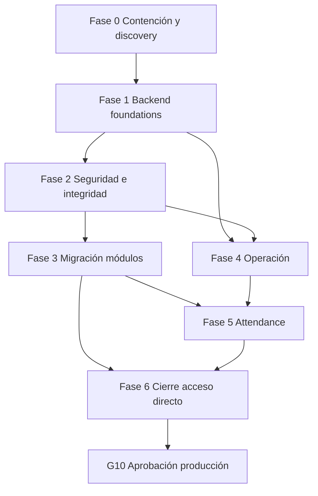

# Dinamic Clean — Roadmap de remediación empresarial

**Clasificación de entrada:** `NOT_READY_FOR_ENTERPRISE_PRODUCTION`  
**Principio:** el **backend tradicional es obligatorio**. RLS/Supabase son defensa e infraestructura, no reemplazo.  
**Frontend:** reutilizar Next.js existente; migrar **data writes** fuera del browser de forma incremental.  
**No** proponer microservicios. Preferir **monolito modular Node.js + TypeScript**.

---

## Fase 0 — Descubrimiento productivo y contención

### Objetivo
Conocer el estado real de producción y contener riesgos inmediatos sin fingir que el sistema ya es enterprise-ready.

### Alcance
- Export schema, policies, grants, buckets, Auth config (read-only).
- Inventariar usuarios/roles y secretos (metadatos).
- Parchear Next critical; revisar exposición `xlsx`.
- Contención: reducir usuarios no esenciales; rotar keys si duda; deshabilitar roles amplios hasta backend.
- Completar matriz RLS live (E-018, E-019).

### Hallazgos
E-004, E-010, E-012, E-013 (inicio), E-018, E-019, E-030

### Dependencias
Acceso admin Supabase + hosting (autorizado).

### Entregables
- Dump versionado en repo (`schema/baseline`).
- Informe contención firmado.
- Matriz policies prod vs repo.

### Criterios de aceptación
- Diff repo↔prod documentado.
- Critical Next parcheado en rama.
- Lista de cuentas con privilegios excesivos revisada.

### Tests
Consultas read-only de evidence; adversarial smoke con rol bajo.

### Riesgo / rollback
Bajo si solo lectura; parches deps con rollback de versión.

### Estimación
**S–M**

### Gate habilitado
Prepara **G0**; no lo cierra solo.

---

## Fase 1 — Fundaciones del backend

### Objetivo
Levantar el backend tradicional mínimo viable como **única puerta de mutación** para módulos piloto.

### Alcance (monolito modular recomendado)
- **Runtime:** Node.js 22 + TypeScript.
- **Framework:** Fastify o NestJS (preferencia: **Fastify** por simplicidad + OpenAPI; Nest si el equipo exige DI/estructura estricta).
- Capas: `http` → `application/services` → `domain` → `infra/supabase-or-pg`.
- Auth: validar JWT Supabase (`getUser`/JWKS) en cada request.
- RBAC central (portar matriz `permisos.ts` a claims/permisos server).
- Validación: Zod/TypeBox.
- Errores problem+json; request ID; structured logs (pino).
- OpenAPI 3.1 generado.
- `GET /healthz`, `/readyz`.
- Rate limiting (Redis o edge).
- CI: lint/tsc/test/build/audit.
- Deploy separado (Railway/Fly/Cloud Run/Vercel server — **NO VERIFICADO** elección).

### Hallazgos
E-001, E-011, E-014 (base), E-016, E-020 (CI), E-022, E-026, E-027

### Dependencias
Fase 0 baseline schema.

### Entregables
- Repo/servicio `dinamic-clean-api` (o carpeta `apps/api` monorepo).
- OpenAPI + clientes tipados para Next.
- Primer endpoints: users + health + employees read.

### Criterios de aceptación
- API autentica JWT; rechaza sin rol.
- OpenAPI publicado en staging.
- CI verde.
- **G1 PARTIAL→PATH** con al menos un módulo detrás de API.

### Tests
Unit RBAC; integration auth; contract OpenAPI.

### Riesgo / rollback
Medio; feature flag: UI aún puede hablar a Supabase hasta Fase 6.

### Estimación
**L**

### Gate habilitado
**G1** (parcial hasta Fase 6 cierre), **G4** (inicio)

---

## Fase 2 — Seguridad e integridad

### Objetivo
RBAC efectivo + RLS defensa + transacciones + storage seguro + audit log.

### Alcance
- Reescribir policies (eliminar `USING(true)` en P0).
- Grants: `authenticated` sin INSERT/UPDATE/DELETE en tablas críticas (solo `service_role`/role API).
- Storage path-scoped; firmas cortas vía API; IaC buckets.
- State machines OC/depósito/CRM/auditoría.
- RPC/transacciones para multipaso.
- `audit_log` append-only.
- Password policy + MFA admin.
- Headers seguridad frontend.

### Hallazgos
E-002, E-003, E-005, E-006, E-007, E-008, E-009, E-017, E-023, E-028, E-029

### Dependencias
Fase 1 API authz.

### Entregables
- Migraciones RLS+grants.
- Módulo audit.
- Documentos state machines.

### Criterios de aceptación
- PostgREST mutación directa falla.
- Transición ilegal 409.
- Asignación compras atómica.
- **G2 PASS**, **G3 PASS** (módulos P0).

### Tests
pgTAP/RLS; chaos transacciones; storage isolation.

### Riesgo / rollback
Alto en policies — staging primero; feature flags por tabla.

### Estimación
**L–XL**

### Gate habilitado
**G2**, **G3**

---

## Fase 3 — Migración de módulos críticos

### Objetivo
Mover escrituras de módulos P0/P1 del browser al backend según `dinamic-clean-backend-migration-inventory.csv`.

### Orden sugerido
1. Usuarios/perfiles  
2. Empleados / asignaciones / asistencias + archivos  
3. Resultados económicos  
4. Compras (pedidos → panel → OC → depósito)  
5. Clientes/domicilios/presupuestos  
6. CRM  
7. Auditorías  

Frontend: reemplazar `supabase.from().insert/update` por `fetch(API)`; SSR puede seguir leyendo vía API o view allowlisted.

### Hallazgos
Inventario completo; E-024

### Dependencias
Fase 2 grants/RLS para no dejar bypass.

### Entregables
- Endpoints por módulo.
- UI adaptada incremental (strangler).
- Tests e2e por módulo migrado.

### Criterios de aceptación
- 0 mutaciones browser a tablas migradas (grep CI).
- Flujos críticos e2e verdes.

### Tests
E2E Playwright por rol; integration DB.

### Riesgo / rollback
Alto — migrar módulo a módulo; dual-write temporal opcional.

### Estimación
**XL**

### Gate habilitado
Refuerza G1–G3; prepara G9

---

## Fase 4 — Operación empresarial

### Objetivo
Continuidad, observabilidad, staging, carga.

### Alcance
- RPO/RTO definidos; backups automáticos; **restore drill**.
- APM + alertas + dashboards.
- Staging = prod-like.
- CD con approvals.
- Load tests (200 emp, 3 años asistencias, N OC concurrentes).
- Runbooks incidentes/DR.
- Paginación/índices/reportes async.

### Hallazgos
E-013, E-014, E-021, E-025, E-030

### Dependencias
Backend desplegado; schema baseline.

### Entregables
- Runbooks; evidencia restore; reportes k6; staging URL.

### Criterios de aceptación
- **G5 PASS** (restore probado).  
- **G6 PASS**.  
- **G7 PASS** criterios acordados.  
- **G8 PASS**.

### Tests
Restore drill; alert fire test; load test firmado.

### Riesgo / rollback
Medio.

### Estimación
**L**

### Gate habilitado
**G5, G6, G7, G8**

---

## Fase 5 — Integración con Attendance

### Objetivo
Integración segura **solo vía backend**.

### Alcance
- Contratos versionados (OpenAPI).
- M2M (client credentials / mTLS / signed webhooks).
- `external_id`, `source_system`, idempotency keys.
- Outbox + workers + retries + DLQ.
- Reconciliación diaria.
- Observabilidad de sync.
- Nunca anon key / browser.

### Hallazgos
E-015

### Dependencias
G1–G3 PASS; empleados/asistencias migrados.

### Entregables
- Adapter Attendance; runbook sync; dashboard lag/errores.

### Criterios de aceptación
- **G9 PASS** en staging con failure injection.

### Tests
Contract, replay, duplicate delivery, partial failure.

### Riesgo / rollback
Medio-alto — feature flag sync off.

### Estimación
**L**

### Gate habilitado
**G9**

---

## Fase 6 — Cierre de acceso directo

### Objetivo
Eliminar evasión del backend; pentest; aprobación.

### Alcance
- Revoke restante grants mutación `authenticated`.
- CI grep: prohibir `.insert/.update/.delete` desde `supabase/client` en módulos migrados.
- Pentest roles + storage + API.
- Soft-delete políticas; retención.
- **G10** comité.

### Hallazgos
E-028

### Dependencias
Fases 1–5.

### Entregables
- Informe pentest; checklist go-live firmado.

### Criterios de aceptación
- Adversarial: browser no muta tablas críticas.
- G0–G6 PASS; G7–G9 según alcance.
- **G10 APPROVE** o rechazo explícito.

### Tests
Pentest scripted + manual AppSec.

### Riesgo / rollback
Alto si quedan pantallas no migradas — inventariar y bloquear release.

### Estimación
**M**

### Gate habilitado
**G10**

---

## Diagrama de dependencias

## Estimación agregada orientativa

| Fase | Tamaño | Nota |
|------|--------|------|
| 0 | S–M | paralelo a decisión de negocio |
| 1 | L | fundación |
| 2 | L–XL | seguridad |
| 3 | XL | strangler módulos |
| 4 | L | SRE |
| 5 | L | integración |
| 6 | M | cierre |

**Camino mínimo seguro a producción empresarial:** Fases 0→2 + módulos P0 de Fase 3 (usuarios, empleados, asistencias, resultados, compras) + Fase 4 (G5–G6) + Fase 6 parcial. Attendance solo tras eso (Fase 5).

## Qué conservar vs reconstruir

| Conservar | Reconstruir / agregar |
|-----------|----------------------|
| UI Next módulos | Capa API backend |
| Triggers numeración / CRM fechas | Policies RLS + grants |
| Tipos dominio compras/CRM | Transacciones y state machines |
| Supabase Auth/DB/Storage | Workers, outbox, audit, CI/CD |
| Service role pattern server-only | Cierre PostgREST writes |
