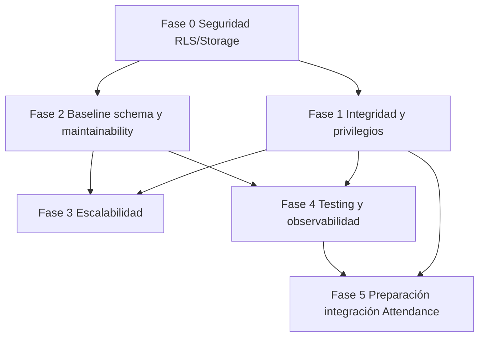

# Dinamic Clean — Roadmap de remediación

**Estado de entrada:** `HIGH_RISK_REQUIRES_REMEDIATION`  
**Principio:** remediar de forma incremental sobre la arquitectura frontend + Supabase (apropiada para app interna single-org). **No** reescribir todo el producto salvo módulos irrecuperables.  
**Dependencia transversal:** exportar y versionar el esquema/RLS productivo (F-004, F-030) **antes** o en paralelo con cualquier hardening serio.

---

## Fase 0 — Bloqueantes de seguridad (P0)

### Objetivo
Impedir que un usuario autenticado de bajo privilegio lea o mute datos fuera de su rol, y cerrar fugas evidentes de storage/financieros.

### Alcance
- Inventario live de `pg_policies` + buckets (completar F-030, F-007).
- Reemplazo de políticas `FOR ALL … USING (true)` en tablas sensibles (F-001, F-002).
- Restringir SELECT de `resultados_mensuales*` (F-003).
- Endurecer Storage presupuestos + dejar de persistir signed URLs anuales (F-005, F-006).
- Actualizar Next a versión parcheada (F-010).

### Hallazgos cubiertos
F-001, F-002, F-003, F-004 (inicio), F-005, F-006, F-008, F-010, F-017, F-030

### Dependencias
- Acceso admin al proyecto Supabase.
- Definición formal de matriz rol × recurso × operación (admin/gerente/compras/supervisor/auditoria).
- Baseline DDL exportado al repo.

### Criterios de aceptación
- Usuario `auditoria` **no** puede `SELECT/UPDATE` CRM, compras, empleados, resultados vía PostgREST.
- Usuario `compras` **no** puede mutar `perfiles.rol` ni leer resultados financieros (salvo decisión explícita).
- Bucket `presupuestos-clientes`: un usuario no puede borrar objetos ajenos fuera de política.
- `asistencias.archivo_url` deja de guardar URLs firmadas de larga duración (path + firmar on-demand).
- `npm audit` sin critical en `next`.
- Matriz RLS documentada y versionada.

### Pruebas necesarias
- Suite de pruebas RLS (SQL o pgTAP / scripts) por rol.
- Pruebas manuales PostgREST con JWT de cada rol.
- Regression smoke de pantallas por rol (proxy sigue funcionando).

### Riesgo de regresión
**Alto** — políticas estrictas pueden romper pantallas que hoy asumen acceso total. Mitigar con matriz y pruebas por módulo.

### Estimación
**L** (1–2 sprints con 1 engineer + owner de negocio para matriz de roles)

---

## Fase 1 — Integridad y permisos (P1)

### Objetivo
Garantizar que mutaciones multi-paso y privilegios administrativos sean correctos y auditables.

### Alcance
- `getUser()` en rutas privilegiadas (F-009).
- Política de passwords + UI `type=password` (F-012).
- Transacciones/RPC para Panel de compras, duplicados, imports (F-013).
- Marcar domicilio principal atómico (F-014).
- Validar transiciones de estado en DB (F-015).
- Validar uploads de justificaciones (F-026).
- Confirmar/bloquear UPDATE de `perfiles.rol` solo vía service role / admin API (F-017 + verificación live).
- Reconciliación createUser + perfil (F-032).

### Hallazgos cubiertos
F-007, F-009, F-011 (inicio), F-012, F-013, F-014, F-015, F-017, F-026, F-032

### Dependencias
Fase 0 (RLS estable). Decisiones de estados canónicos por documento.

### Criterios de aceptación
- No quedan cabeceras OC/depósito sin ítems ante fallo parcial (o hay compensación automática).
- Transición `recepcionada → borrador` rechazada por DB.
- Admin API usa `getUser()`; password policy endurecida.
- Policies del bucket `justificaciones` versionadas.

### Pruebas necesarias
- Tests de integración de RPC de asignación.
- Tests de transición ilegal de estado.
- Test de creación de usuario con fallo simulado de perfil.

### Riesgo de regresión
**Medio** — cambios en flujos de compras/ausencias.

### Estimación
**M–L**

---

## Fase 2 — Arquitectura y mantenibilidad (P2)

### Objetivo
Hacer el sistema operable por un equipo profesional sin reescritura total.

### Alcance
- Baseline migrations + `supabase/config.toml` + renumeración 0002/0023 (F-018, F-004).
- Extraer lógica de `PanelComprasAsignacion` / importadores a módulos testeables (F-025).
- Unificar tipos TS ↔ SQL (generar types desde schema).
- Documentación operativa reemplazando README genérico (F-027).
- Security headers (F-021).
- Sustituir/contener `xlsx` (F-011).

### Hallazgos cubiertos
F-004 (cierre), F-011, F-018, F-021, F-025, F-027, F-031

### Dependencias
Fases 0–1 para no tipar políticas incorrectas.

### Criterios de aceptación
- `supabase db dump` / migrations reproducen schema de staging.
- Lint limpio en CI.
- Types generados (`supabase gen types`) usados en app.
- Runbook: env vars, roles, deploy, rollback.

### Pruebas necesarias
- Apply migrations en proyecto vacío de staging.
- Diff schema staging vs prod = 0 (salvo seeds).

### Riesgo de regresión
**Medio-bajo** si se hace con shadow DB.

### Estimación
**L**

---

## Fase 3 — Escalabilidad (P2)

### Objetivo
Soportar crecimiento de historial (asistencias, CRM, compras, resultados) sin degradar UX.

### Alcance
- Paginación server-side en listados clave (F-020).
- Índices por `fecha`, `estado`, `cliente_id`, `created_at` (validar con `EXPLAIN` en prod).
- Evitar `select('*')` en páginas calientes.
- Límites en imports masivos; procesamiento por lotes ya parcialmente presente en `CargaListaPrecios`.

### Hallazgos cubiertos
F-020

### Dependencias
Métricas de volumen (conteos SQL de evidencia §5).

### Criterios de aceptación
- Listados principales responden <2s con 10× datos actuales (medido en staging).
- No se cargan tablas completas de asistencias/resultados en el browser.

### Pruebas necesarias
- Seeds de volumen; Lighthouse/network payload checks.

### Riesgo de regresión
**Medio** (cambios de UI de listados).

### Estimación
**M**

---

## Fase 4 — Testing y observabilidad (P2)

### Objetivo
Detectar regresiones de seguridad y operación antes de producción.

### Alcance
- CI: `lint` + `tsc` + `build` + `npm audit` (F-019).
- Tests RLS mínimos + e2e login/roles (Playwright o similar).
- Error tracking (Sentry u equivalente) + logs estructurados (F-022).
- Tabla `audit_log` para mutaciones admin (usuarios, resultados, deletes CRM).

### Hallazgos cubiertos
F-019, F-022

### Dependencias
Fase 0 matriz de roles; hosting con env para DSN.

### Criterios de aceptación
- PR no mergea si lint/tsc/build fallan.
- Al menos 1 test automatizado por rol que demuestre denegación cross-módulo.
- Errores 5xx de API usuarios visibles en tracker.

### Pruebas necesarias
- Pipeline verde en PR de ejemplo.
- Chaos: usuario no-admin llama API usuarios → 403 + log.

### Riesgo de regresión
**Bajo**.

### Estimación
**M**

---

## Fase 5 — Preparación para integraciones (P1/P2)

### Objetivo
Dejar contratos estables y una superficie server-side segura antes de conectar Dinamic Attendance.

### Alcance
- Inventario de entidades a sincronizar + owner (source of truth).
- Asegurar `id` UUID estables, `created_at`/`updated_at` en todas las entidades de integración (F-023).
- Soft-delete o `activo` consistente; prohibir hard delete en entidades compartidas.
- Outbox/eventos o Edge Functions **con service role** para sync (nunca desde browser).
- Idempotency keys en imports/upserts.
- Auth máquina a máquina (JWT service / signed webhooks) — no anon key.
- Sustituir acoplamiento a filtros UI (`empresa` string) por modelo explícito si Attendance necesita multi-compañía.

### Hallazgos cubiertos
F-016, F-023, F-029

### Dependencias
Fases 0–1 obligatorias; 2–4 fuertemente recomendadas.

### Criterios de aceptación
- Documento de contrato (OpenAPI o JSON Schema) aprobado por ambos sistemas.
- Prueba de sync en staging con replay idempotente.
- Ningún endpoint de integración invocable con solo anon key + sesión de usuario final sin scopes.
- Runbook de conflictos (update concurrente Clean ↔ Attendance).

### Pruebas necesarias
- Contract tests; replay de webhook; prueba de usuario no autorizado.

### Riesgo de regresión
**Medio** (cambios de modelo de datos).

### Estimación
**L–XL** según alcance de entidades

---

## Orden recomendado y dependencias

## Qué no hacer todavía

- No diseñar la integración completa con Dinamic Attendance sobre RLS permisivo.
- No introducir microservicios “por arquitectura”: no hay evidencia de necesidad operativa aún.
- No reescribir el frontend Next “desde cero”: el build tipa y la estructura de módulos es comprensible; el problema central es **autorización e integridad en la capa de datos**.

## Decisión de remediar vs reconstruir

| Parte | Recomendación |
|-------|----------------|
| App Next (UI módulos) | **Remediar** |
| Modelo de roles en proxy | **Conservar como UX**; no como seguridad |
| RLS / Storage / schema baseline | **Rehacer políticas + versionar** (no “parche cosmética”) |
| Imports Excel / Panel compras | **Extraer a RPC**; no reescritura total de UI |
| Integración Attendance | **Nueva capa server** (Edge Functions o backend mínimo), no desde cliente |
