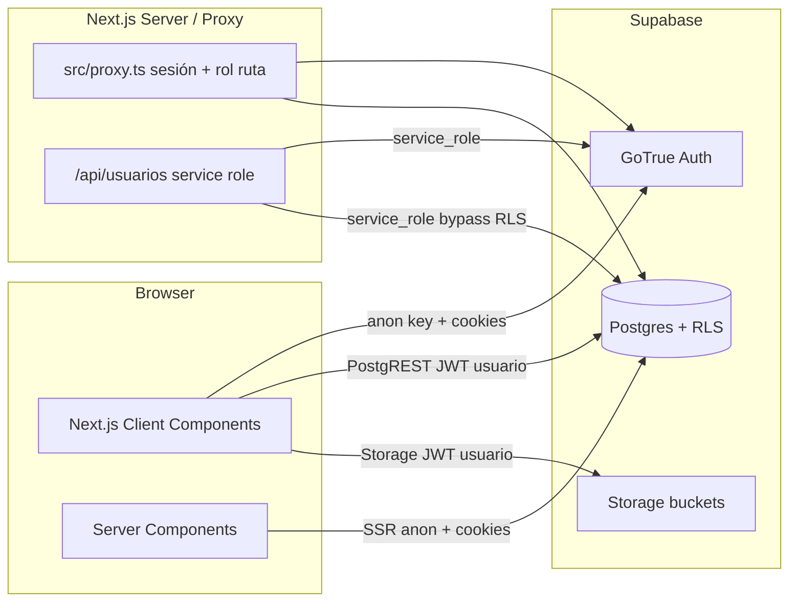

# Dinamic Clean — Auditoría técnica integral

**Fecha:** 2026-09-15  
**Auditoría:** estática + comandos locales no destructivos  
**Estado de viabilidad:** `HIGH_RISK_REQUIRES_REMEDIATION`  
**Artefactos complementarios:** `dinamic-clean-findings.csv`, `dinamic-clean-remediation-roadmap.md`, `dinamic-clean-audit-evidence.md`

---

## 1. Resumen ejecutivo

Dinamic Clean es una aplicación **Next.js 16 (App Router) + React 19 + Supabase (Auth, Postgres, Storage)** sin backend tradicional propio, salvo un Route Handler `/api/usuarios` que usa la **service role** para administración de cuentas.

El sistema cubre operación interna de una empresa de limpieza: **RRHH/asistencias**, **compras**, **clientes**, **CRM/ventas**, **auditoría de calidad** y **resultados económicos**. La tabla `empresas` y el campo `empleados.empresa` representan **razones sociales internas (Dinamic / Moral)**, no tenants SaaS multiempresa.

El hallazgo dominante es de seguridad: **la mayoría de las políticas RLS versionadas otorgan `FOR ALL TO authenticated USING (true)`**. El control por rol (`permisos.ts` + `proxy.ts`) es **navegación/UX**, y el propio código lo documenta. Un usuario con sesión válida puede, con alta probabilidad, **bypass de roles** vía PostgREST y acceder a datos fuera de su módulo (CRM, compras, RRHH, PDFs, e incluso lectura de resultados financieros).

Además, el **esquema base productivo no está completo en el repositorio** (compras/RRHH/`perfiles`/`empresas` se asumen preexistentes). No hay tests, ni CI, ni observabilidad. El build y el type-check pasan; el lint falla. Hay vulnerabilidades de dependencias (Next critical, xlsx high).

**Conclusión corta:** no es una base confiable para integración con Dinamic Attendance ni para uso productivo multi-rol hasta remediar RLS, versionar el esquema real y endurecer mutaciones sensibles. La arquitectura frontend+Supabase **sí puede ser apropiada** para una app interna single-org **si** la autorización se implementa correctamente en Postgres/Storage.

---

## 2. Nivel general de riesgo

| Dimensión | Nivel | Notas |
|-----------|-------|-------|
| Seguridad / authz | **CRÍTICO** | RLS permisivo + RBAC solo UI |
| Aislamiento multiempresa | **N/A → RIESGO CONCEPTUAL** | No hay tenants; si se esperaba, está ausente |
| Integridad de datos | **ALTO** | Multi-paso sin transacciones; estados solo UI |
| Reconstruibilidad | **ALTO** | Schema core fuera del repo |
| Operación / observabilidad | **ALTO** | Sin CI, tests, monitoring, runbook |
| Escalabilidad cercana | **MEDIO** | OK a escala chica; listados sin paginar |
| Calidad de código | **MEDIO** | Tipado OK; componentes grandes; `any` puntual |
| Dependencias | **ALTO** | Next critical; xlsx sin fix |

**Riesgo agregado:** **ALTO / CRÍTICO** para cualquier despliegue con usuarios no plenamente confiables o con roles diferenciados.

---

## 3. Nivel de confianza y limitaciones

| Área | Confianza | Limitación |
|------|-----------|------------|
| Código Next / flujos UI | Alta | Repo completo leído/muestreado |
| Migraciones versionadas | Alta | 33 SQL inspeccionados |
| RLS en tablas **creadas** en migraciones | Alta | Texto de políticas explícito |
| RLS en tablas **preexistentes** | Baja | **NO VERIFICADO** en remoto |
| Políticas bucket `justificaciones` | Baja | Dashboard-only |
| UPDATE de `perfiles.rol` por cliente | Baja | Solo SELECT versionado |
| Secretos en hosting / historial | Baja | No auditado remoto ni `git log -S` exhaustivo |
| Comportamiento productivo exacto | Media | Depende de qué SQL se aplicó a mano |

Clasificación usada en hallazgos:

1. **defecto confirmado** — evidencia en repo  
2. **riesgo probable** — patrón claro, falta confirmación live  
3. **información faltante** — requiere Supabase/ops  
4. **mejora opcional** — sin exploit directo

---

## 4. Arquitectura reconstruida

### 4.1 Diagrama (comprobado)

**Inferido (no hay Edge Functions en repo):** no existe capa de dominio server-side para compras/CRM/RRHH; la lógica de negocio vive en componentes cliente y en algunos triggers SQL.

### 4.2 Diferencias clave comprobadas vs asumidas

| Afirmación | Tipo |
|------------|------|
| “La protección real la hace RLS” (`page.tsx`, `proxy.ts`) | Comentario en código — **pero RLS versionada es permisiva** → defensa fallida en la práctica |
| Roles por módulo | **Comprobado** en `permisos.ts` |
| Service role solo server | **Comprobado** en `admin.ts` |
| Multi-tenant por `empresa_id` | **Falso** respecto a aislamiento; `empresa_id` es documento comercial |

---

## 5. Inventario técnico

### 5.1 Stack y versiones (`package.json`)

| Componente | Versión |
|------------|---------|
| Next.js | 16.2.12 |
| React / React DOM | 19.2.4 |
| TypeScript | ^5 |
| Tailwind | ^4 |
| `@supabase/ssr` | ^0.12.4 |
| `@supabase/supabase-js` | ^2.111.0 |
| recharts | ^3.10.1 |
| xlsx | ^0.18.5 |
| @dnd-kit/core | ^6.3.1 |

Scripts: `dev`, `build`, `start`, `lint`. **No** hay `test` ni `typecheck`.

### 5.2 Estructura de módulos (rutas App Router)

| Módulo | Rutas principales | Roles UI (`permisos.ts`) |
|--------|-------------------|---------------------------|
| Portal | `/portal` | cualquier autenticado |
| Compras | `/pedidos-compra`, `/panel-compras`, `/ordenes-compra`, `/pedidos-deposito`, `/proveedores`, `/articulos`, `/clientes` | admin/gerente/compras (+ supervisor en pedidos-compra) |
| Empresas | `/empresas` | admin/gerente |
| Dashboard | `/dashboard` | admin/gerente |
| Ventas/CRM | `/ventas/*` | admin/gerente |
| Auditoría | `/auditorias/*` | admin/gerente/supervisor/auditoria (checklist sin supervisor) |
| RRHH | `/empleados`, `/ausencias`, `/asignaciones` | admin/gerente |
| Resultados | `/resultados` | admin |
| Usuarios | `/usuarios` | admin |
| API | `/api/usuarios` | admin (chequeo en handler) |

### 5.3 Entidades (mix comprobado / inferido)

**Creadas en migraciones (comprobado):**  
`proveedores`, `articulos`, `articulos_proveedor`, `articulos_proveedor_pendientes`, `cliente_domicilios`, `resultados_mensuales`, `resultados_mensuales_detalle`, CRM (`crm_*`), `supervisores`, auditoría (`auditoria_*`), `cliente_presupuestos`.

**Usadas por la app pero sin CREATE en repo (preexistentes / NO VERIFICADO DDL):**  
`perfiles`, `empresas`, `clientes`, `pedidos_compra(+items)`, `ordenes_compra(+items)`, `pedidos_deposito(+items)`, `empleados`, `asignaciones`, `asistencias`, `codigos_novedad`.

### 5.4 Auth / Storage / Integraciones

- **Auth:** email/password (`signInWithPassword`); logout; admin crea usuarios con `email_confirm: true`; cambio password admin-only.
- **Storage:** `presupuestos-clientes` (migrado, privado, policy abierta a authenticated); `justificaciones` (manual, **NO VERIFICADO**).
- **Integraciones externas:** ninguna API de terceros versionada; export Excel (Bejerman, ausencias, catálogo); WhatsApp deep-links helper.
- **Edge Functions:** no hay en el repositorio.
- **Env:** `NEXT_PUBLIC_SUPABASE_URL`, `NEXT_PUBLIC_SUPABASE_ANON_KEY`, `SUPABASE_SERVICE_ROLE_KEY` (server).

### 5.5 Operaciones desde el navegador

Casi **toda** la mutación de negocio: inserts/updates/deletes Supabase desde Client Components (`PedidoCompraForm`, `PanelComprasAsignacion`, CRM, auditoría, empleados, etc.).  
Excepción privilegiada: creación/rol/password de usuarios vía `/api/usuarios`.

---

## 6. Flujos principales

### 6.1 Autenticación y acceso

1. Login → cookie sesión SSR.  
2. `proxy.ts`: si no hay `session` → `/login`; si hay, lee `perfiles.rol` y aplica `puedeAcceder`.  
3. NavBar oculta links según rol.  
4. Datos: cliente Supabase con JWT del usuario → RLS.

### 6.2 Compras (crítico)

Pedido de compra → Panel asigna líneas a OC y/o depósito → estados `borrador/enviada/recepcionada` → impresión/PDF.  
`empresa_id` elegido en UI (Dinamic/Moral como emisor).  
Asignación multi-insert **sin transacción** (F-013).

### 6.3 RRHH

Empleados (marca `empresa` string) → asignaciones a clientes → ausencias/`asistencias` con posible archivo en Storage y URL firmada 1 año (F-006).

### 6.4 CRM

Prospectos → oportunidades (CHECK de estados en SQL) → seguimientos → tablero drag-and-drop actualiza `estado` directo.

### 6.5 Auditoría de calidad

Plantilla checklist → planificaciones → carga de auditoría + respuestas → plan de acción.

### 6.6 Resultados

Import Excel → upsert `resultados_mensuales` + detalle; **write** RLS admin; **read** todos autenticados (F-003).

---

## 7. Análisis de Supabase

### 7.1 Base de datos

**Fortalezas comprobadas**

- UUIDs, `timestamptz`, varios `UNIQUE`/`CHECK` (CRM estados, mes 1–12, rol ampliado).
- Triggers de numeración atómica (secuencias) para pedidos/OC/depósito/artículos.
- Congelado de textos de envío (integridad documental ante edición posterior de domicilios).
- Soft-flag `activo` en varias entidades.

**Debilidades**

- Esquema core no versionado (F-004).
- Migraciones con número duplicado `0002` y hueco `0023` (F-018).
- Sin `search_path` en functions (F-031).
- Sin SECURITY DEFINER en migraciones (bien), pero tampoco RPCs de dominio atómicas.
- Seeds CRM enormes en git (posible PII) (F-024).
- `crm_vistas.usuario_id` sin FK (documentado a propósito).

### 7.2 Storage

| Bucket | Origen | Public | Policy en repo |
|--------|--------|--------|----------------|
| `presupuestos-clientes` | migración 0030 | false | ALL authenticated |
| `justificaciones` | dashboard | **NO VERIFICADO** | **NO VERIFICADO** |

Presupuestos: path en DB + signed URL corta al descargar (mejor patrón).  
Justificaciones: signed URL 1 año **persistida** (peor patrón).

### 7.3 Claves

- Anon/publishable en frontend: **esperado**; riesgo depende de RLS.  
- Service role: solo server — **positivo** (F-028).  
- No hay `.env` versionados en el working tree.

---

## 8. Matriz de RLS y permisos

### 8.1 Políticas versionadas (extracto)

| Recurso | Operación | Rol efectivo DB | Política o control | Riesgo | Evidencia |
|---------|-----------|-----------------|--------------------|--------|-----------|
| `proveedores` | ALL | authenticated | `using (true)` | CRITICAL | `0001:32-33` |
| `articulos` | ALL | authenticated | `using (true)` | CRITICAL | `0001:66-67` |
| `articulos_proveedor` | ALL | authenticated | `using (true)` | CRITICAL | `0001:90-91` |
| `cliente_domicilios` | ALL | authenticated | `using (true)` | CRITICAL | `0004:24-25` |
| `crm_*` | ALL | authenticated | `using (true)` | CRITICAL | `0018`, `0024` |
| `auditoria_*` | ALL | authenticated | `using (true)` | CRITICAL | `0028` |
| `cliente_presupuestos` | ALL | authenticated | `using (true)` | CRITICAL | `0030:30-31` |
| `storage.objects` presupuestos | ALL | authenticated | bucket match only | HIGH | `0030:13-18` |
| `resultados_mensuales` | SELECT | authenticated | `using (true)` | HIGH | `0014:40-41` |
| `resultados_mensuales` | INSERT/UPDATE | admin (via perfiles) | exists rol=admin | OK parcial | `0014:43-50` |
| `resultados_mensuales_detalle` | DELETE | admin | admin check | OK parcial | `0016` |
| `perfiles` | SELECT | authenticated | `using (true)` | MEDIUM | `0015:7-8` |
| `perfiles` | INSERT/UPDATE/DELETE | **?** | **NO VERIFICADO** | HIGH potencial | — |
| `pedidos_compra_items` | UPDATE | authenticated | policy adicional `using(true)` | HIGH | `0007:24-25` |
| `empresas`, `empleados`, `asistencias`, headers compras | * | **?** | **NO VERIFICADO** | HIGH | preexistentes |
| Rutas Next | navegación | rol app | `proxy` + `permisos.ts` | solo UX | `permisos.ts:1-5` |
| `/api/usuarios` | POST/PATCH | admin app | `idSiEsAdmin` + service role | OK con salvedad session | `route.ts` |

**Auditoría RLS: INCOMPLETA** respecto al proyecto remoto. Completar con SQL de `dinamic-clean-audit-evidence.md` §5.

### 8.2 Escenario de explotación realista (confirmado en diseño)

1. Admin crea usuario rol `auditoria` (solo `/auditorias` en UI).  
2. Ese usuario abre DevTools / usa la anon key + access token de la cookie.  
3. Ejecuta `GET /rest/v1/resultados_mensuales` o `DELETE /rest/v1/crm_oportunidades?id=eq.…`.  
4. Con políticas versionadas, **debería funcionar**.  
5. Impacto: filtración financiera, destrucción de CRM, manipulación de compras/auditorías.

---

## 9. Análisis multiempresa

### Veredicto

**No es un sistema multi-tenant.** Es una **aplicación single-organization** con dos marcas/razones sociales operativas.

| Pregunta | Respuesta basada en evidencia |
|----------|-------------------------------|
| ¿Cómo se representa una empresa? | Tabla `empresas` (CUIT, domicilio) + string `DINAMIC`/`MORAL` en empleados |
| ¿Usuario pertenece a una empresa? | **No** hay membership; el usuario tiene `perfiles.rol` global |
| ¿Varias empresas por usuario? | N/A — no hay tenants |
| ¿`company_id` del cliente? | `empresa_id` en documentos elegido en formularios; **no** atado al usuario |
| ¿Aislamiento RLS? | **No** |
| ¿Usuario empresa A vs B? | En el modelo actual A/B no son tenants; **todos** los auth users comparten el mismo dataset (sujeto a RLS permisiva) |

Si el negocio **requiere** aislar datos entre clientes corporativos distintos (SaaS), el sistema **no está listo** y haría falta un rediseño de tenant (`org_id` + membership + RLS).  
Si el negocio es **solo Dinamic Clean interno**, el problema no es “cross-tenant” sino **cross-role** (F-001/F-002).

---

## 10. Seguridad

### Defectos confirmados

- F-001 / F-002 Broken Access Control / BOLA entre roles.  
- F-003 exposición financiera.  
- F-005 / F-006 storage.  
- F-008 IDOR estructural.  
- F-010 / F-011 dependencias.  
- F-012 passwords débiles / UI.  
- F-017 enumeración de perfiles.

### Riesgos probables / NO VERIFICADO

- Auto-elevación `perfiles.rol` si hay UPDATE abierto.  
- Bucket `justificaciones` mal configurado.  
- RLS de tablas core peor o igual de permisiva.

### Controles positivos

- Service role no en bundle (F-028).  
- Cookies SSR (no localStorage de tokens).  
- Sin `dangerouslySetInnerHTML` encontrado.  
- Sin open redirect encontrado.  
- API usuarios exige admin (si `getSession` + perfil son correctos).

### Headers / CSRF / rate limit

- Sin CSP/HSTS en `next.config` (F-021).  
- Sin rate limiting app-level (depende de Supabase Auth).  
- CSRF en `/api/usuarios`: mitigación probable SameSite; **NO VERIFICADO** flags exactos.

---

## 11. Calidad y mantenibilidad

| Aspecto | Evaluación |
|---------|------------|
| Separación UI / dominio | Débil: reglas en Client Components grandes |
| Tipado | `strict: true`; `tsc` OK; `any` en ~16 sitios; lint en rojo |
| Duplicación | Formularios/tablas similares; compras mejor tipado central (`types/compras.ts`) |
| Archivos grandes | `PanelComprasAsignacion` ~590 LOC; importadores 300–400 |
| Comentarios | Útiles y honestos (incluyen admisiones de seguridad) |
| README | Genérico create-next-app — no documenta el sistema |
| Código muerto | No auditado exhaustivamente; no se encontraron mocks de prod evidentes |
| Consistencia UI↔SQL | Parcial: CHECK CRM en SQL vs transiciones OC solo en UI |

Facilidad de modificación: **aceptable para features UI**, **riesgosa para seguridad/integridad** sin capa confiable.

---

## 12. Integridad de datos

| Tema | Estado |
|------|--------|
| Precondiciones de negocio | Mayormente en UI |
| Transiciones de estado | UI (`Estado*Boton`, tablero); bypasseables (F-015) |
| Operaciones parciales | Confirmadas en panel compras / imports (F-013) |
| Concurrencia domicilio principal | Race (F-014) pese a índice único parcial |
| Soft delete | `activo` en varias tablas; hard delete en oportunidades |
| Auditoría de cambios | Ausente |
| Idempotencia | Parcial (`upsert` asistencias; imports resultados por anio/mes) |
| Reglas que deberían estar en DB | Transiciones estado; “solo compras muta OC”; no borrar resultados; cupos de asignación ≤ pendiente |

---

## 13. Escalabilidad y rendimiento

A escala de una sola operación mediana, el diseño es usable. Riesgos al crecer:

- Listados sin `.range()` / paginación (pedidos, CRM, resultados `select('*')`).  
- Filtros en memoria en tablas cliente.  
- Imports Excel en el browser (CPU/memoria del usuario).  
- Sin colas para trabajos largos.  
- No se observaron canales realtime colgados (positivo).

No se justifica microservicios por performance hoy; sí **paginación, índices y jobs server-side** para imports.

---

## 14. Testing

| Tipo | Presente |
|------|----------|
| Unitarios | No |
| Integración | No |
| E2E | No |
| RLS tests | No |
| CI | No |
| Lint | Sí (falla localmente) |
| Typecheck | Implícito en `next build` / `tsc` OK |
| Build | OK |

**Matriz mínima recomendada (pre-integración):**

1. Login + redirect por rol (5 roles).  
2. PostgREST negado: `auditoria` ↛ `resultados_mensuales` write/read según política deseada.  
3. `compras` ↛ `perfiles` update.  
4. Asignación panel compras atómica (éxito/fallo parcial).  
5. Transición ilegal de estado OC.  
6. Storage: usuario A no borra presupuesto de path ajeno (si se path-scopea).  
7. API usuarios 403 para no-admin.  
8. Smoke build + lint en CI.

---

## 15. Observabilidad y despliegue

- Sin health checks, Sentry, métricas, audit log.  
- Sin Dockerfile/CI/CD versionado.  
- Deploy inferido: Vercel-like + Supabase cloud (**NO VERIFICADO**).  
- Migraciones pensadas para “SQL Editor” manual → **drift** probable.  
- Backups: no documentados en repo (`.gitignore` menciona `/backups/` local).  
- **Reconstrucción solo desde repo: NO.**

---

## 16. Preparación para integraciones

| Requisito | Estado |
|-----------|--------|
| IDs estables UUID | Parcial (sí en tablas modernas) |
| Source of truth clara | No documentada |
| `updated_at` uniforme | Parcial |
| Soft delete | Inconsistente |
| Idempotencia / outbox / webhooks | Ausente |
| Auth M2M | Ausente (solo user JWT + service role admin usuarios) |
| Exposición segura | No — cliente demasiado poderoso |
| Edge/backend para sync | Necesario antes de integrar |

**Prerrequisitos antes de Dinamic Attendance:** cerrar Fase 0–1 del roadmap; definir contrato de entidades (empleados/asistencias/clientes); sync solo server-side; no confiar en anon key para privilegios de integración.

---

## 17. Hallazgos detallados

Ver filas en `dinamic-clean-findings.csv` (F-001 … F-032). Resumen por severidad:

| Severidad | IDs |
|-----------|-----|
| CRITICAL | F-001, F-002 |
| HIGH | F-003…F-011, F-030 |
| MEDIUM | F-012…F-024, F-031, F-032 |
| LOW | F-025…F-027 |
| INFO | F-028, F-029 |

Cada hallazgo en el CSV incluye severidad, prioridad, evidencia, impacto, recomendación, esfuerzo, confianza y status (`confirmed` / `probable` / `incomplete`).

---

## 18. Aspectos positivos comprobados

1. TypeScript strict + **build y `tsc` verdes**.  
2. Uso correcto de **service role solo en servidor**.  
3. Matriz de roles de navegación **explícita y fail-closed** si no hay rol.  
4. Algunos CHECK/UNIQUE/triggers de numeración bien pensados.  
5. Comentarios que documentan decisiones (aunque revelan el gap de RLS).  
6. Módulo compras con tipos compartidos relativamente maduros.  
7. Presupuestos: path en DB + URL corta al vuelo (buen patrón, spoileado por policy abierta).  
8. No hay tokens en `localStorage`.  
9. App Router + proxy Next 16 cableado (middleware/proxy presente en build).  
10. Arquitectura BaaS **conceptualmente viable** para app interna si se corrige authz.

---

## 19. Información faltante

1. Dump real de schema + `pg_policies` productivo.  
2. Policies y configuración del bucket `justificaciones`.  
3. Políticas WRITE de `perfiles`.  
4. Confirmación de migraciones aplicadas vs archivos del repo.  
5. Inventario de usuarios/roles en Auth.  
6. Configuración de hosting, headers, backups, alertas.  
7. Intención de producto: ¿single-org o multi-tenant futuro?  
8. Alcance exacto de datos a compartir con Attendance.  
9. Si las migraciones `0019`/`0022` contienen PII real.  
10. Cookie security flags en producción.

---

## 20. Conclusión de viabilidad

### Estado: `HIGH_RISK_REQUIRES_REMEDIATION`

No `NOT_READY` absoluto: el producto **funciona como app interna** con usuarios de confianza plena y un solo equipo.  
No `READY_WITH_MINOR_CHANGES`: el gap de autorización es estructural.  
No hace falta `READY_WITH_ARCHITECTURAL_CHANGES` global (rewrite): hace falta **rehacer el modelo de autorización/datos** y una **capa server para integraciones**, manteniendo el frontend.

### Respuestas de cierre

1. **¿Seguro para uso productivo?**  
   **No**, si hay roles diferenciados o datos sensibles (RRHH, finanzas, CRM). Solo tolerable con círculo muy cerrado de usuarios admin-equivalentes y aceptación consciente del riesgo.

2. **¿Aislamiento real entre empresas?**  
   **No aplica como multi-tenant.** Entre Dinamic/Moral no hay aislamiento de seguridad; es el mismo dataset. Cross-role isolation: **no**.

3. **¿Operaciones sensibles protegidas del cliente?**  
   **Parcialmente.** Solo admin de usuarios usa service role. El resto de mutaciones sensibles van **desde el browser** con RLS permisiva.

4. **¿RLS suficiente y correcto?**  
   **No.** RLS está “encendido” pero políticas `using (true)` lo anulan. Además incompleto en repo.

5. **¿El repo permite reconstruir el sistema?**  
   **No** (falta schema base, storage justificaciones, posiblemente policies remotas, seeds/ops).

6. **¿Puede escalar razonablemente?**  
   **Sí a escala chica/mediana** con remediaciones de paginación/índices; no está listo para alto volumen histórico sin trabajo.

7. **¿Mantenible por un equipo profesional?**  
   **Sí, con deuda:** tipado y módulos existen; faltan tests, schema-as-code, límites de componentes y seguridad.

8. **¿Listo para integrarse con Dinamic Attendance?**  
   **No.**

9. **¿Qué corregir antes de integrar?**  
   - RLS por rol (y policies storage).  
   - Versionar schema real.  
   - Mutaciones atómicas / estados en DB.  
   - Capa server (Edge Function/backend) para sync M2M.  
   - Contratos, `updated_at`, soft-delete, idempotencia.  
   - CI + tests RLS.  
   - Parchear Next / revisar xlsx.

10. **¿Remediar o reconstruir?**  
    **Remediar** el frontend y el dominio de módulos.  
    **Rehacer** políticas RLS/Storage y baseline de migraciones.  
    **Agregar** (no reemplazar todo) una capa de integración server-side.  
    **No** reescribir Next completo sin evidencia de inviabilidad incremental.
